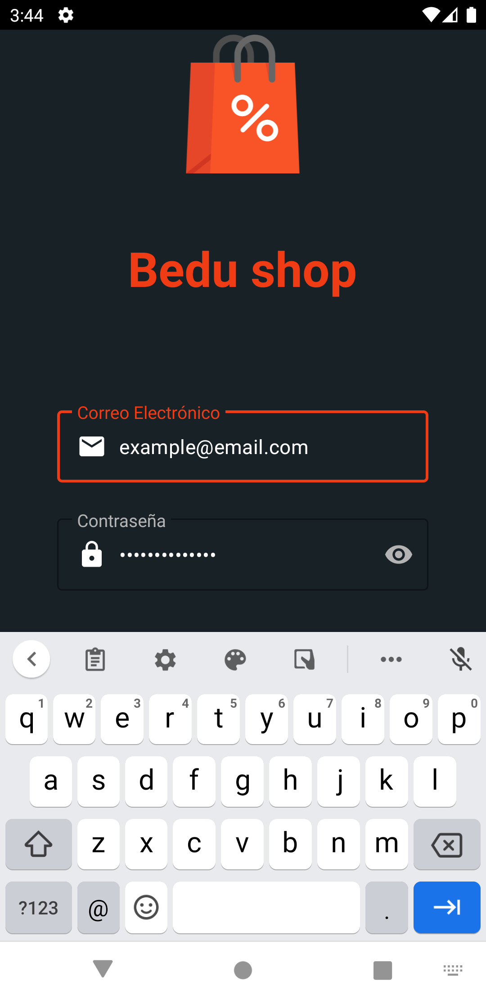
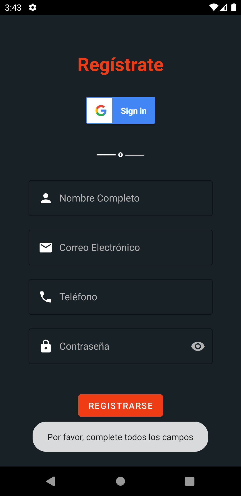
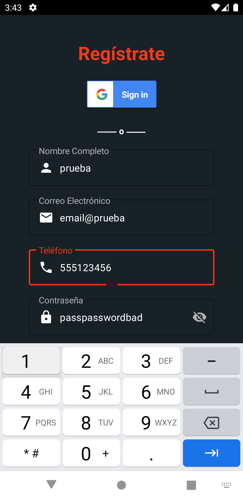
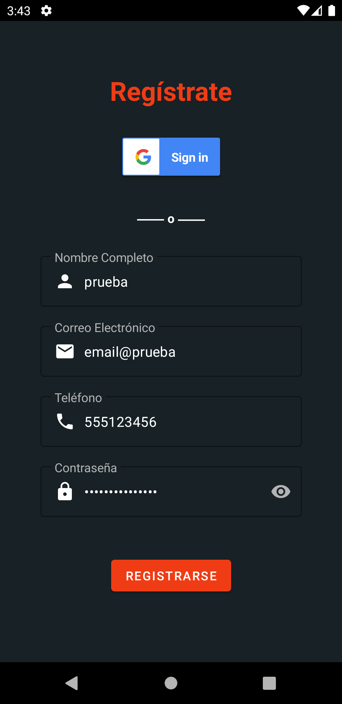
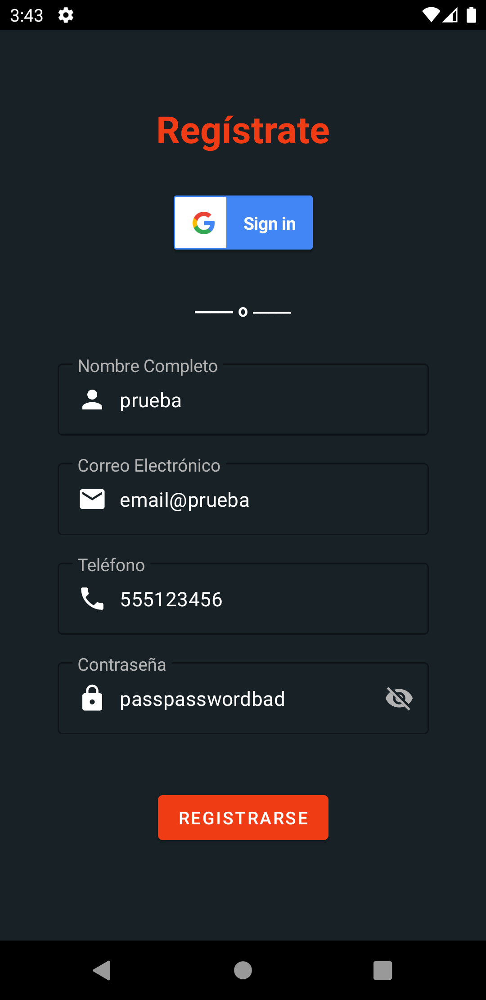
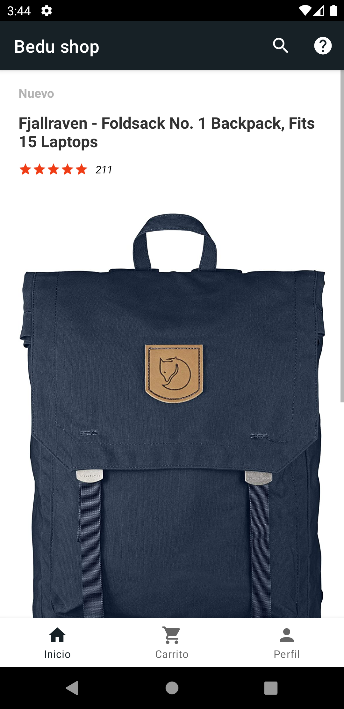
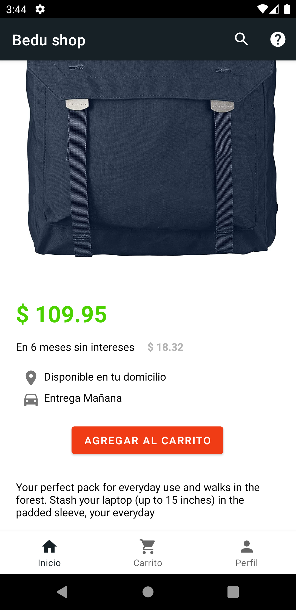
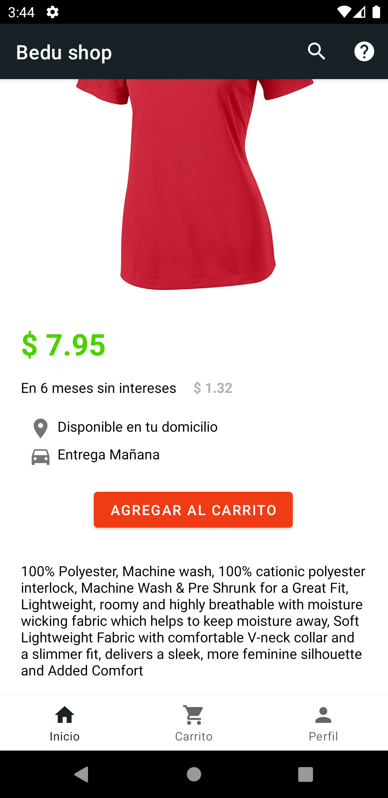
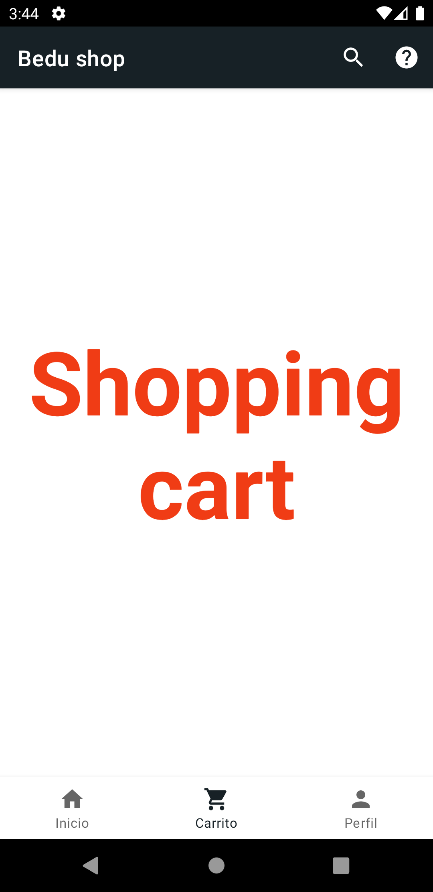
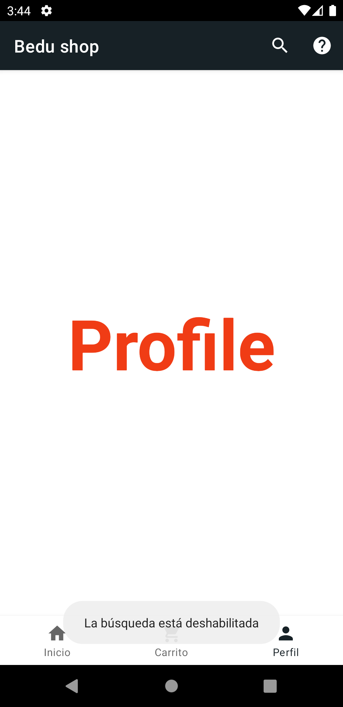

# Decisiones de diseño

---

**[Documentación](root.md)** | **[Recursos de BEDU y Referencias](resources.md)**

---

# Tabla de contenidos

- [Colores predefinidos](#colores-predefinidos)

# Colores predefinidos

| Color                            | Code          | Usado en          |
|----------------------------------|:-------------:|------------------:|
|  | `#f03c15`     | botón y el título |
|  | `#172126`     | background        |

# Logearse

## Ingresando el email

# Registrarse

## Sin rellenar los campos

## Ingresando el campo del teléfono

## Campos llenos sin ver la contraseña

## Campos llenos sin ver la contraseña

## Mostrando la contraseña

# Bedu Shop

## Tienda

## Producto 1

## Producto 1: descripción

## Producto 2

## ShoppingCart

## Perfil

---

**[Documentación](root.md)** | **[Recursos de BEDU y Referencias](resources.md)**
