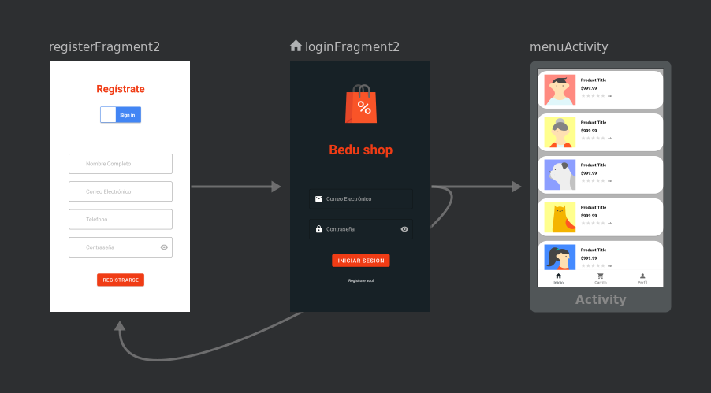
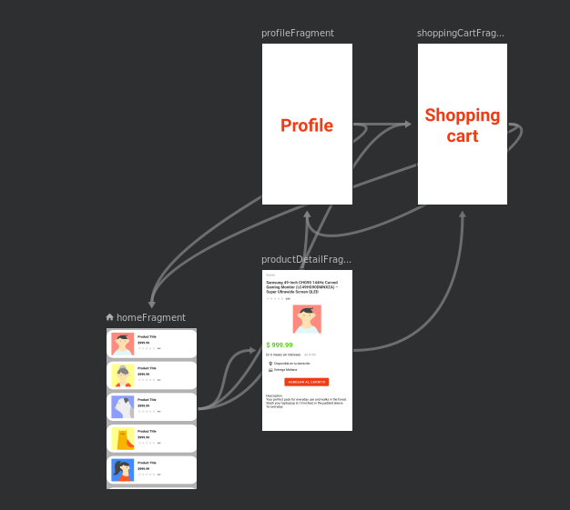
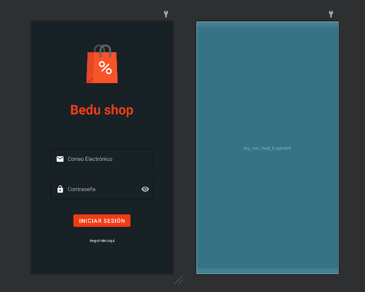
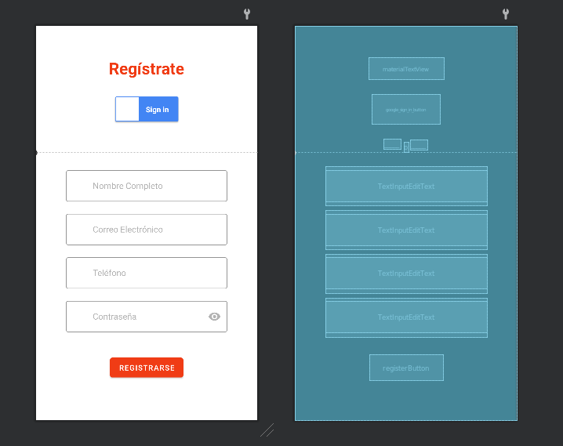
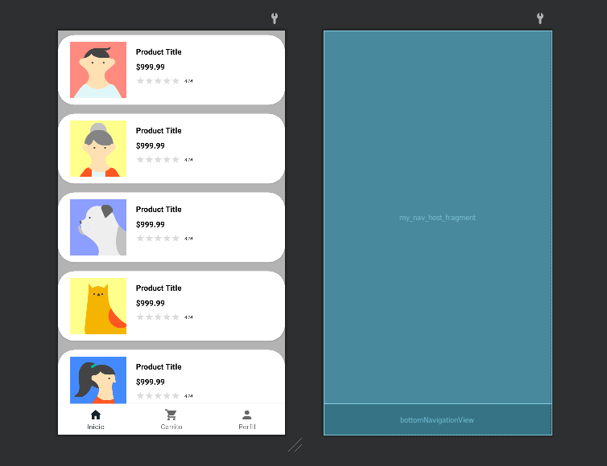
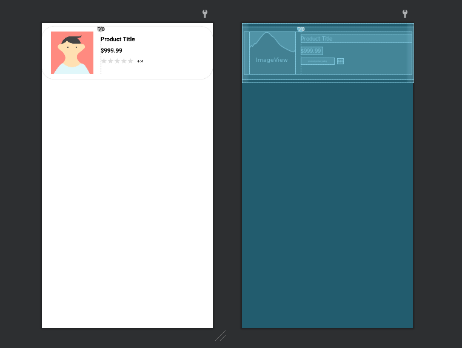
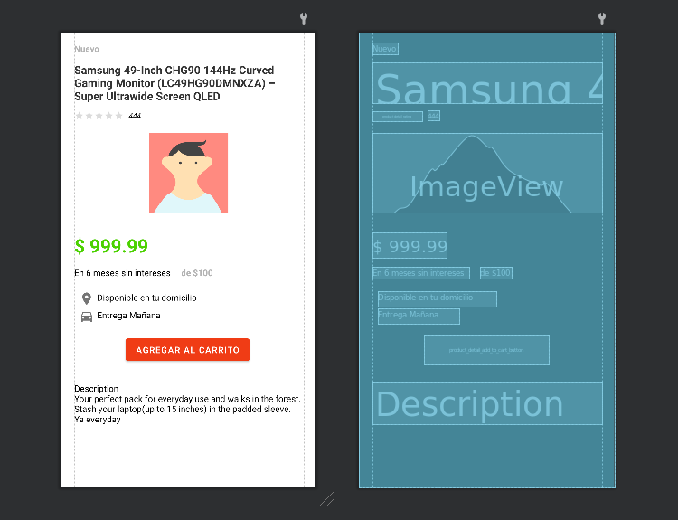
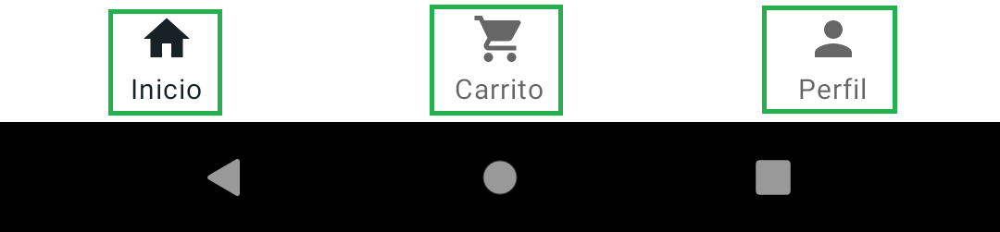

# Decisiones de implementación

---

**[README](../README.md)** | **[Documentación](root.md)** | **[Recursos de BEDU y Referencias](resources.md)**

---

# Tabla de contenidos

- [Flujo](#flujo)
    - [Main navigation](#main-navigation)
    - [Menu navigation](#menu-navigation)
- [Dificultades y soluciones](#dificultades-y-soluciones)
    - [Rating y votos random](#rating-y-votos-random)
    - [Menú de navegación](#menú-de-navegación)

# Flujo

## Main navigation


## Menu navigation


---









# Dificultades y soluciones

## Rating y votos random

<div align="center">


</div>

- Contexto:

  Cada producto utilizado en nuestro RecyclerView tiene dos valores que se instancian de forma aleatoria (rating y cantidad de votos)

- Dificultad:

  Al asignar los valores dentro del `HomeFragment`, estos mismos se volvían a instanciar de forma aleatoria cada vez que cargábamos el Fragment (esto sucedía cada vez que se seleccionaba la opción “Inicio” en nuestro BottomNavigationView)

- Solución:

  Colocamos la creación de la lista de productos dentro de nuestro `MenuActivity`, así como también la creación de sus valores aleatorios (específicamente en la función sobrescrita `onCreate`, que se ejecuta una sola vez), esta información ya creada se almacena dentro del **companion object** para que pueda ser recolectada luego en el `HomeFragment` cuando sea necesario.

---
## 

<div align="center">


</div>

- Contexto:

  Al seleccionar un producto que se encuentre en el listado (`RecyclerView`), se debe enviar la información de este mismo a otro Fragment llamado `ProductDetailFragment`, para que el cliente lo pueda visualizar completamente junto con su descripción.

- Dificultad:

  El hecho de realizar esta operación dentro de un Fragment hacia otro Fragment a través de la función `findNavController().navigate()` nos lleva a querer investigar una forma segura de realizar este proceso para enviar únicamente nuestro producto por cada clickListener ejecutado.

- Solución:

  Logramos incluir el uso de `SafeArgs` para manejar la navegación considerada **safe** debido al hecho de indicar en el Fragment receptor (En nuestro caso: `ProductDetailFragment`) el tipo de dato Parcelable que queremos recibir (En nuestro caso: `Product`).


---

## 

&nbsp;

<div align="center">


</div>

- Contexto:

  Queremos mostrar en cada producto del listado (`RecyclerView`) las imágenes que se encuentran al visitar las URLs recibidas en nuestro “products.json”.

- Dificultad:

  El hecho de insertar la imagen directamente, como se realizaba hasta el momento, en cada vista del `RecyclerView` no funcionaba, ya que se trataban de Strings y no direcciones id de imágenes que podríamos recolectar de nuestra carpeta “Res”.

- Solución:

  Implementamos la dependencia llamada “Picasso” (`com.squareup.picasso:picasso:2.71828`), la cual nos aporta de diversos métodos creados para la abstracción de esta dificultad.

  Ejemplo:

  ```kotlin
  Picasso.get().load(product.image).into(productImage)
  ```

  Siendo:

  - `product.image` -> La URL que recibimos.

  - `productImage` -> La `ImageView` identificada en nuestro Layout donde pondremos la imagen.


---

## Menú de navegación

&nbsp;

<div align="center">



</div>

- Contexto:

  Necesitamos crear la funcionalidad para nuestro `BottomNavigationView`, en la cual deberíamos observar que, dependiendo del item seleccionado, se despliegue el Fragment correspondiente.

- Dificultad:

  Al indicarle dentro de nuestro `FragmentContainerView` el tipo de `“navGraph”` que debería utilizar, no tenemos la certeza de cual Fragment está utilizando en cada momento ni la forma en la que podremos indicarle cual debería mostrar en el momento necesario.

- Solución:

  Logramos implementar el uso de una función que nos permite asignar el `navController` del `navHostFragment` perteneciente a la `MenuActivity`, en el `BottomNavigationView`. Lo cual realiza completamente la identificación de cual Fragment se debería mostrar según el item seleccionado, con la única precaución de tener en cada uno de estos ítems el id exactamente igual que el nombre del Fragment que queremos mostrar para cada caso.
---

**[README](../README.md)** | **[Documentación](root.md)** | **[Recursos de BEDU y Referencias](resources.md)**
